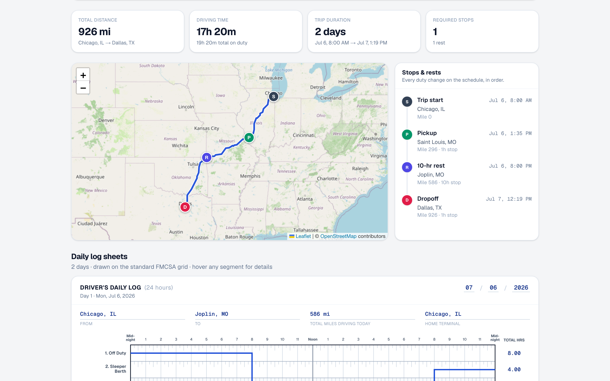
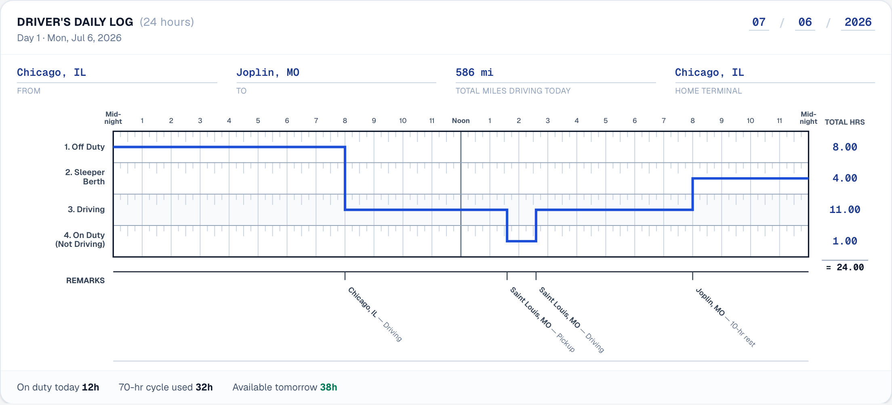

# ELD Trip Planner

Full-stack app that plans FMCSA hours-of-service compliant truck trips. Enter your current location, pickup, dropoff, and the hours already used in your 70 hr / 8 day cycle — it maps the route with every required stop and draws a driver's daily log sheet for each day of the trip.





## What it does

- **Plans the route** current → pickup → dropoff with free, key-less services (OSRM routing, Nominatim geocoding, OpenStreetMap tiles) and shows it on an interactive map with a marker for every stop.
- **Schedules the trip against the property-carrier HOS rules** (49 CFR 395.3, 70 hr / 8 day, no adverse conditions):
  - 11-hour driving limit inside a 14-hour on-duty window; the window opens with the first on-duty activity after 10+ consecutive hours off and is not extended by breaks
  - 30-minute break after 8 cumulative driving hours (any 30+ min non-driving period qualifies — the 1-hour pickup or a fuel stop resets it)
  - 70-hour/8-day rolling on-duty cycle seeded from "current cycle used", with a 34-hour restart when exhausted; only driving is barred past a limit — non-driving work (pickup, drop-off, fueling) stays legal past the 14-hour and 70-hour marks
  - 10-hour rests (logged as sleeper berth) whenever the driving or window clock runs out
  - Fuel stop (30 min, on duty) at least every 1,000 miles; 1 hour on duty each for pickup and drop-off
- **Draws one FMCSA daily log sheet per calendar day**: the standard midnight-to-midnight grid with quarter-hour ticks, the duty-status line, per-status totals that always sum to 24.00, miles driven, from/to, remarks with the nearest city at every duty change, and a 70-hr recap. Sheets are print-ready (Print logs button).

Every day's totals, the stop schedule, and the log grids come from one continuous simulated timeline, so the map, timeline, and sheets always agree.

## Stack & layout

| Piece | Tech |
|---|---|
| `frontend/` | Next.js (App Router, TypeScript), Tailwind CSS, react-leaflet |
| `backend/` | Django + Django REST Framework (stateless JSON API) |
| `e2e/` | Playwright suite that boots both servers and drives the whole workflow |

```
backend/
  config/               # Django settings/urls/wsgi
  trips/
    services/hos.py     # HOS scheduler (the core)
    services/logs.py    # daily log sheet builder
    services/routing.py # OSRM + offline mock
    services/geocoding.py # Nominatim + bundled US-city fallback
    tests/              # unit tests incl. an independent compliance checker
frontend/
  app/                  # page, layout, theme
  components/           # TripForm, RouteMap, LogSheet (SVG), StopsTimeline…
  lib/                  # API client, types, formatting
e2e/                    # Playwright specs (desktop + mobile projects)
```

## Running locally

Backend (Python 3.11+):

```bash
cd backend
python3 -m venv .venv && .venv/bin/pip install -r requirements.txt
.venv/bin/python manage.py runserver 8000
```

Frontend (Node 20+):

```bash
cd frontend
npm install
npm run dev   # http://localhost:3000 (expects the API on :8000)
```

Set `NEXT_PUBLIC_API_URL` if the backend runs elsewhere. Setting `USE_MOCK_APIS=1` on the backend swaps Nominatim/OSRM for a bundled offline dataset (used by e2e tests; also the automatic fallback if Nominatim is unreachable).

## Tests

```bash
# Backend: 24 unit tests, including an independent HOS compliance checker
cd backend && .venv/bin/python manage.py test trips

# E2E: boots Django (mock mode) + a production Next build, then runs
# 11 scenarios across desktop and mobile viewports
npm install && npx playwright install chromium
npm run test:e2e
```

## API

`POST /api/trips/plan/`

```json
{
  "current_location": "Chicago, IL",
  "pickup_location": {"name": "St. Louis, MO", "lat": 38.627, "lon": -90.1994},
  "dropoff_location": "Dallas, TX",
  "current_cycle_used_hours": 20,
  "start_time": "2026-07-06T08:00:00"
}
```

Locations may be free text (geocoded server-side) or `{name, lat, lon}` from the autocomplete. Returns `{summary, route: {geometry…}, stops[], logs[]}` where each log holds the day's duty entries, totals, miles, remarks, and recap. Also: `GET /api/geocode/?q=…` for suggestions, `GET /api/health/`.

## Deploying

- **Backend** — any Python host (Render/Railway/Fly): `gunicorn config.wsgi`, env `DJANGO_SECRET_KEY`, `DJANGO_DEBUG=0`, `DJANGO_ALLOWED_HOSTS=<host>`, `CORS_ALLOWED_ORIGINS=<frontend origin>`. `gunicorn` + `whitenoise` are already in `requirements.txt`.
- **Frontend** — Vercel: set root to `frontend/`, env `NEXT_PUBLIC_API_URL=<backend URL>`.

## Assumptions & simplifications

- Property-carrying driver, 70 hr/8 day cycle, no adverse driving conditions (per the brief); sleeper-berth split provision not used.
- OSRM car durations are used as truck driving times; fuel stops take 30 min.
- Cycle hours reset only via the 34-hour restart (day-by-day recap roll-off is not simulated — conservative).
- Times are naive local ("time standard of home terminal", as the paper log requires).
- The trip start defaults to "now" and can be set explicitly; day 1 before the start is logged off duty.
